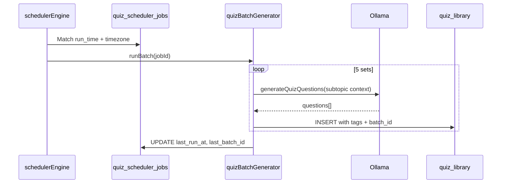

# Nightly Quiz Scheduler — Design Document

**Status:** Implemented (v1)  
**Last updated:** 2026-05-17  
**Related code:** `server/services/schedulerEngine.js`, `quizGeneratorService.js`, `routes/quiz-scheduler.js`, `routes/quiz-library.js`, `routes/topics.js`

---

## 1. Understanding Summary

- **What:** Extend the existing quiz scheduler so that each configured nightly job generates **5 separate quiz sets** for the admin-selected **topics and subtopics**, with consistent **searchable tags**.
- **Why:** Automate fresh daily content without manual quiz creation; make quizzes easy to find by subject, topic, subtopic, difficulty, and batch.
- **Who:** Admins configure jobs in the admin UI; students discover quizzes via the quiz library (and optional visibility windows).
- **Constraints:** Express + PostgreSQL + Ollama; in-process `node-cron` (server must be running); reuse existing `generateQuizQuestions()` and `extractTags()` patterns.
- **Explicit non-goals (v1):** Distributed job queue (Redis/Bull); multi-instance cron deduplication; replacing manual quiz creation; Prisma migration.

---

## 2. Confirmed Requirements

| Requirement | Detail |
|-------------|--------|
| Schedule | Daily (or weekly) at admin-configured time |
| Scope | Real DB `topics` + `subtopics` (not free-text checkbox list) |
| Sets per run | **5 sets** per job execution for the selected topics/subtopics |
| Tagging | Every generated set tagged for library search (`tags && $1` GIN) |
| Questions | Existing `question_count` + `difficulty` per job |

---

## 3. Assumptions

| # | Assumption | Default if not overridden |
|---|------------|---------------------------|
| A1 | A **set** = one complete playable quiz (title + N questions), not a question pool inside one quiz | — |
| A2 | **5 sets** applies **per scheduler job run** (not 5 per subtopic unless configured later) | `sets_per_run = 5` |
| A3 | **One subtopic selected:** 5 variant sets for that subtopic. **Multiple subtopics:** round-robin (one subtopic per set, cycle until 5 sets) | See §6.2 — **confirmed (option C)** |
| A4 | Generated output is stored in **`quiz_library`** (search + tags) and optionally linked from `generated_quizzes` for visibility | Approach A |
| A5 | **IST** (`Asia/Kolkata`, UTC+5:30) for run time, “today” batch boundaries, and duplicate-run guards; per-job override allowed later | Default `timezone = 'Asia/Kolkata'` |
| A6 | Max **5 sequential Ollama calls** per job per night is acceptable (~5–15 min total depending on model) | Queue async if too slow |
| A7 | Failed set generation logs error, continues other sets; batch marked `partial` if any fail | — |
| A8 | Tags use existing `extractTags()` conventions plus scheduler-specific tags | See §5 |

---

## 4. Non-Functional Requirements

| Area | Target (v1) |
|------|----------------|
| **Performance** | Complete 5 sets within 30 minutes off-peak; do not block HTTP for >1s (use async worker after cron tick) |
| **Scale** | ≤20 active scheduler jobs; ≤50 subtopics per job; ~25 quizzes/night total across all jobs |
| **Reliability** | Cron requires long-running Node (PM2); document OS-level backup cron calling `run-now` API |
| **Security** | Admin-only job CRUD (`manage_quizzes`); no student-triggered bulk generation |
| **Maintainability** | Shared `extractTags` util; single write path to `quiz_library` |
| **Search** | Sub-100ms tag filter on `quiz_library` using existing GIN index |

---

## 5. Tag Taxonomy

Reuse and extend `server/routes/quiz-library.js` → `extractTags()`:

| Tag prefix | Example | Source |
|------------|---------|--------|
| `subject:` | `subject:math` | Parent topic category or title |
| `topic:` | `topic:fractions` | Subtopic title (existing) |
| `difficulty:` | `difficulty:medium` | Job difficulty |
| `grade:` | `grade:5` | Topic `age_group` / quiz grade |
| `age:` | `age:9-14` | Topic age group |
| `batch:` | `batch:2026-05-17-job-abc` | Nightly run identifier |
| `set:` | `set:3-of-5` | Set index within batch |
| `source:` | `source:scheduler` | Distinguish from manual/AI student jobs |
| `job:` | `job:<scheduler_job_id>` | Traceability |

**Search examples:**

- All nightly math quizzes: `tags @> ARRAY['subject:math', 'source:scheduler']`
- Tonight’s batch: `tags @> ARRAY['batch:2026-05-17-…']`
- Subtopic-specific: `tags @> ARRAY['topic:photosynthesis']`

---

## 6. Recommended Approach (A — Scheduler → `quiz_library`)

### 6.1 Why this approach

| Option | Verdict |
|--------|---------|
| **A — Write to `quiz_library` + tags** | **Recommended** — search already works; minimal student UI change |
| B — Write only to `quizzes` + `quiz_questions` | Better for attempts, but tags/search not built on `quizzes` |
| C — Keep only `generated_quizzes` JSON blob | No tag search; duplicates third pipeline |

### 6.2 Set distribution (option C — confirmed)

Distribution depends on how many subtopics are selected on the job.

#### Case 1: Exactly one subtopic → 5 variants

All **5 sets** are different versions of the **same** subtopic (different LLM runs, distinct titles).

```
Subtopics: [S1]
Sets:      [S1-v1, S1-v2, S1-v3, S1-v4, S1-v5]
Titles:    "Fractions – Nightly Set 1 of 5", … "Set 5 of 5"
Tags:      topic:fractions, set:1-of-5 … set:5-of-5, variant:1 … variant:5
```

Use a slightly different prompt seed or instruction per variant (e.g. “emphasize word problems” on set 2) so sets are not duplicates.

#### Case 2: Multiple subtopics → round-robin

Build a work list of active subtopics, assign **5 sets** round-robin (one primary subtopic per set):

```
Subtopics: [S1, S2, S3]
Sets:      [S1, S2, S3, S1, S2]   → 5 sets
```

Each set:

1. Loads subtopic row (`title`, `description`, `key_points`)
2. Loads parent topic (`title`, `age_group`, `category`)
3. Calls `generateQuizQuestions({ subtopicId, topics: [subtopic.title], … })`
4. Builds tags via shared `extractTags()` + batch/set/job tags
5. Inserts into `quiz_library` with `questions` JSONB

### 6.3 High-level flow



### 6.4 Async execution

The 1-minute cron tick should **enqueue** batch work, not await 5 LLM calls:

1. Cron detects due job (match `run_time` in job timezone, default **IST / `Asia/Kolkata`**) → insert `quiz_generation_batches` row `status=running`
2. `setImmediate` / reuse `quiz_ai_generation_jobs` pattern → process 5 sets sequentially
3. Update batch `status=completed|partial|failed`

This avoids blocking other scheduled jobs.

---

## 7. Schema Changes (proposed migration)

### 7.1 `quiz_scheduler_jobs` — new columns

```sql
ALTER TABLE quiz_scheduler_jobs
  ADD COLUMN IF NOT EXISTS sets_per_run SMALLINT NOT NULL DEFAULT 5,
  ADD COLUMN IF NOT EXISTS topic_ids UUID[] NOT NULL DEFAULT '{}',
  ADD COLUMN IF NOT EXISTS subtopic_ids UUID[] NOT NULL DEFAULT '{}',
  ADD COLUMN IF NOT EXISTS timezone VARCHAR(64) NOT NULL DEFAULT 'Asia/Kolkata',
  ADD COLUMN IF NOT EXISTS target_storage VARCHAR(20) NOT NULL DEFAULT 'quiz_library'
    CHECK (target_storage IN ('quiz_library', 'generated_quizzes', 'both'));
```

- Deprecate free-text `topics JSONB` after UI migration (keep for backward compat reads).

### 7.2 `quiz_generation_batches` — new table

```sql
CREATE TABLE quiz_generation_batches (
  id UUID PRIMARY KEY DEFAULT gen_random_uuid(),
  scheduler_job_id UUID REFERENCES quiz_scheduler_jobs(id) ON DELETE SET NULL,
  batch_tag VARCHAR(100) NOT NULL,        -- e.g. 2026-05-17-<jobId-short>
  sets_requested SMALLINT NOT NULL,
  sets_completed SMALLINT NOT NULL DEFAULT 0,
  sets_failed SMALLINT NOT NULL DEFAULT 0,
  status VARCHAR(20) NOT NULL DEFAULT 'running'
    CHECK (status IN ('running','completed','partial','failed')),
  started_at TIMESTAMP NOT NULL DEFAULT CURRENT_TIMESTAMP,
  completed_at TIMESTAMP,
  error_summary TEXT
);
```

### 7.3 `quiz_library` — optional link

```sql
ALTER TABLE quiz_library
  ADD COLUMN IF NOT EXISTS generation_batch_id UUID REFERENCES quiz_generation_batches(id),
  ADD COLUMN IF NOT EXISTS scheduler_job_id UUID REFERENCES quiz_scheduler_jobs(id);
```

### 7.4 `generated_quizzes` — optional mirror

If visibility windows are still required for “daily challenge” UX, insert a lightweight row per set pointing to `quiz_library.id` (new column `library_id UUID`).

---

## 8. Student Experience (option B — confirmed)

### 8.1 Quiz library (existing)

- All 5 nightly sets appear in **`quiz_library`** with full tag search.
- Filters: `source:scheduler`, `batch:<date-job>`, `topic:…`, `set:N-of-5`.

### 8.2 “Today’s quizzes” (new)

Dedicated student surface for the **latest batch** from active scheduler jobs (not a replacement for the library).

| Element | Behavior |
|---------|----------|
| **Placement** | Section on Quiz Hub / home, or marquee (reuse patterns from `StudentUpcomingTestsMarquee` / `ScheduledQuizzes`) |
| **Content** | Up to 5 cards from **most recent completed batch** (same calendar day in org timezone) |
| **API** | `GET /api/quiz-scheduler/today` → `{ batchTag, sets: [{ libraryId, title, subtopic, difficulty, setIndex }] }` |
| **Empty state** | “No quizzes yet today — check back after &lt;configured time&gt;” |
| **CTA** | “Browse all” → library pre-filtered by `batch:` tag |

**Note:** This is separate from `generated_quizzes` visibility windows. v1 uses library rows as source of truth; marquee reads by `batch_tag` + `created_at`, not `generated_quizzes.status`.

### 8.3 Tracked play — hybrid (option C — confirmed)

Nightly sets **always** land in `quiz_library` first. A normalized `quizzes` row is created **only when** a student starts a tracked attempt.

| Step | Action |
|------|--------|
| 1 | Scheduler writes 5 rows to `quiz_library` (source of truth for content + tags) |
| 2 | Student opens set from “Today’s quizzes” or library |
| 3 | Student taps **Start quiz** (tracked) |
| 4 | API `POST /api/quiz-library/:id/start-tracked` — if no link exists, **copy** library → `quizzes` + `quiz_questions` |
| 5 | Store `quiz_library.linked_quiz_id` (new column) to avoid duplicate copies |
| 6 | Redirect to existing quiz session flow → `quiz_attempts` as today |

**Untracked preview (optional v1.1):** “Practice” mode could play from library JSON without copying — out of scope unless requested.

#### Schema addition

```sql
ALTER TABLE quiz_library
  ADD COLUMN IF NOT EXISTS linked_quiz_id UUID REFERENCES quizzes(id);
```

#### Copy rules (`library → quizzes`)

| Library field | Quiz field |
|---------------|------------|
| `title` | `name` |
| `subject` | `subject` |
| `difficulty` | `difficulty` |
| `grade_level` | `grade_level` |
| `questions` JSONB | `quiz_questions` rows |
| subtopic from tags / metadata | `subtopic_id` if resolvable |

Copy is **idempotent**: second start reuses `linked_quiz_id`.

#### Analytics

- **Discovery:** library `usage_count` or view events
- **Performance:** `quiz_attempts` on linked `quizzes.id`
- Admin batch report: join `quiz_generation_batches` → `quiz_library` → `quizzes` → attempts

---

## 9. API & Admin UI Changes

| Area | Change |
|------|--------|
| `GET/POST/PUT /api/quiz-scheduler/jobs` | Accept `topic_ids`, `subtopic_ids`, `sets_per_run`, `timezone` |
| `QuizSchedulerManagement.tsx` | Replace `DEFAULT_TOPICS` checkboxes with topic/subtopic picker (reuse `TopicSubtopicSelector`) |
| `GET /api/quiz-library` | Already supports `?tags=` — document batch/search UX |
| `POST /api/quiz-library/:id/start-tracked` | Copy to `quizzes` if needed; return `quizId` for session |
| Admin preview | Show last batch: 5/5 sets, links to library entries + attempt counts |

---

## 10. Error Handling & Edge Cases

| Case | Behavior |
|------|----------|
| Ollama down | Batch `failed`; no empty library rows; alert in admin dashboard |
| Partial failure (3/5) | Batch `partial`; retry failed sets via admin “Retry batch” |
| Subtopic deactivated mid-run | Skip inactive; redistribute sets among remaining |
| Duplicate cron fire | Guard with `last_run_at` date + job id lock (same calendar day in job timezone) |
| Empty subtopic list | Reject job save at API validation |

---

## 11. Testing Strategy

| Level | What to verify |
|-------|----------------|
| Unit | Round-robin set allocation; tag builder; timezone → UTC conversion |
| Integration | Mock Ollama → 5 `quiz_library` rows with correct tags |
| E2E | Admin creates job → manual `run-now` → library search by `batch:` tag |
| Manual | PM2 restart does not double-run same batch (day guard) |

---

## 12. Decision Log

| ID | Decision | Alternatives | Rationale |
|----|----------|--------------|-----------|
| D1 | **5 sets per job run** | 5 per subtopic; 1 set only | User confirmed: 5 sets for selected topics/subtopics |
| D2 | **Store in `quiz_library`** | `quizzes` only; `generated_quizzes` only | Tags + GIN search already exist |
| D3 | **Option C — variants if 1 subtopic; round-robin if many** | Always round-robin; always 5 variants | User confirmed: depth for single focus, breadth when multiple |
| D4 | **Async batch after cron tick** | Sync in cron | Prevents 1-min scheduler blocking |
| D5 | **Shared `extractTags` module** | Duplicate tag logic in scheduler | Single source of truth |
| D6 | **Keep `generated_quizzes` optional** | Remove scheduler table | Preserves visibility window UX if needed |
| D7 | **Student UX: library + “Today’s quizzes”** | Library only; library + visibility windows | User confirmed B — discoverability without losing search |
| D8 | **Hybrid attempts (option C)** | Library-only v1; always mirror to `quizzes` | User confirmed C — discovery in library; tracking on demand |
| D9 | **Default timezone IST (`Asia/Kolkata`)** | UTC only; US timezones | User confirmed IST for nightly run + “today” UX |

---

## 13. Open Questions

1. ~~**Set distribution**~~ — **Resolved:** option C (variants ×1 subtopic; round-robin ×many).
2. ~~**Student surface**~~ — **Resolved:** option **B** — quiz library **plus** a “Today’s quizzes” student section/marquee for the latest nightly batch.
3. ~~**Attempts**~~ — **Resolved:** option **C** — hybrid: library for discovery; **tracked play** copies into `quizzes` on first “Start quiz”.
4. ~~**Timezone**~~ — **Resolved:** **IST** — IANA `Asia/Kolkata` (UTC+5:30) as default for all scheduler jobs and “Today’s quizzes” day boundary.

---

## 14. Implementation Phases (handoff preview)

| Phase | Scope |
|-------|--------|
| **P1** | Migration + shared `extractTags` + `quizBatchGenerator` service |
| **P2** | Scheduler job API + cron integration + day guard |
| **P3** | Admin UI topic/subtopic picker + batch status |
| **P4** | Student “Today’s quizzes” + `GET /api/quiz-scheduler/today` |
| **P5** | `start-tracked` copy flow + `linked_quiz_id` + attempt analytics |

---

## 15. Current vs Target (gap checklist)

- [x] Cron scheduler exists  
- [x] Ollama generation exists  
- [x] Topics/subtopics in DB  
- [x] Tag search on `quiz_library`  
- [ ] `sets_per_run = 5` on jobs  
- [ ] FK `topic_ids` / `subtopic_ids` on jobs  
- [ ] 5 inserts per run with batch tags  
- [ ] Admin UI wired to DB topics  
- [ ] Timezone-aware nightly run  
- [ ] Async batch worker  
- [ ] Student “Today’s quizzes” UI + API  
- [ ] `start-tracked` hybrid copy to `quizzes`  

---

---

## 16. Understanding Lock — Final (all questions resolved)

| # | Decision |
|---|----------|
| Sets | **5 per job run** |
| Distribution | **C** — 5 variants if 1 subtopic; round-robin if many |
| Storage | **`quiz_library`** + tags |
| Student UX | **B** — library + “Today’s quizzes” |
| Attempts | **C** — hybrid `start-tracked` → `quizzes` |
| Timezone | **IST** (`Asia/Kolkata`) |

**Status:** Ready for implementation handoff (see §14).

*Last confirmed: 2026-05-17*
